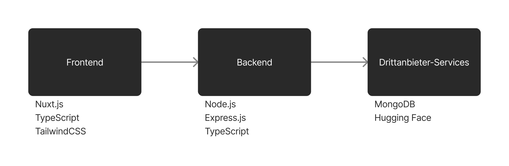

# LearnLab

LearnLab provides learning with flashcards &ndash; **powered by AI**.

It has the capability to generate flashcards from a website.

> This is a <ins>research project</ins>, in order to demonstrate <ins>how AI can influence learning processes</ins> in education.

https://github.com/moreluis/learnlab/assets/156832999/44f24c28-95f2-470d-95eb-550bea30e097

## Table of contents
- [About this project](#about-this-project)
- [Setting up the project](#setting-up-the-project)
    - [Backend](#backend)
    - [Frontend](#frontend)
- [Evaluation](#evaluation)
- [Possible To-do's](#possible-to-dos)
- [Style](#style)
- [License](#license)

## About this project
This project uses [Nuxt](https://nuxt.com), [Typescript](https://www.typescriptlang.org/) and [TailwindCSS](https://tailwindcss.com/) for the frontend. The backend is a REST API made with [Node.js](https://nodejs.org/) and the [Express.js Framework](https://expressjs.com/) and written in [Typescript](https://www.typescriptlang.org/). As a database, the project uses [MongoDB](https://www.mongodb.com/). It also utilizes the [Hugging Face API](https://huggingface.co/).

<div style="text-align: center">
    
</div>

## Setting up the project

The project consists of a backend and frontend.

The backend is a [TypeScript](https://www.typescriptlang.org/) [Express](https://expressjs.com/) application, using [MongoDB](https://www.mongodb.com/) as its database.

The frontend is built using [Nuxt](https://nuxt.com/) and [TailwindCSS](https://tailwindcss.com/).

### Backend

#### Configuring the backend
Edit the `.env` file located in the `./backend` directory.

The first three variables are mandatory, the last three are optional:
1. `OWNER_USERNAME`: The username you use as a admin. This will allow you to register yourself without an invite code - just pick that username you entered in the variable - and will also let you generate invites.
2. `FRONTEND_DOMAIN`: The domain of your frontend in `example.domain` style. If not on default port, specify it afterwards: `localhost:3000` or `example.domain:3000`.
3. `MONGODB_URL`: URL of your MongoDB database, with password.
4. `PORT`: Port of the backend service.
5. `HUGGINGFACE_ACCESS_TOKEN`: [Huggingface](https://huggingface.co) access token. Optional but recommended, because of rate limitation.
6. `HUGGINGFACE_MODEL`: Specify the [Huggingface](https://huggingface.co) (AI) model. Must be of type `textGeneration`. The default model is `google/flan-t5-base`.

```sh
# MANDATORY VARIABLES
# Owner username: used for first user registration (without invite code) and admin functionality
OWNER_USERNAME="test"

# Domain of your frontend
FRONTEND_DOMAIN="localhost:3000"

# URL of the MongoDB Database
MONGODB_URL=""


# OPTIONAL VARIABLES
# Port the server will open on (Optional, default: '80')
PORT=80

# Huggingface.co access token (Optional, but recommended)
HUGGINGFACE_ACCESS_TOKEN=""

# Huggingface.co model to generate the cards. Must be of type 'textGeneration'. (Optional, default: 'google/flan-t5-base')
HUGGINGFACE_MODEL=""
```

#### Starting the backend
1. Open the `./backend` directory in your terminal (if not done already):
```sh 
cd backend
``` 
2. Install the required packages using your package manager:
```sh
# Using NPM
npm install

# Using Yarn
yarn install
```
3. Start the backend server:
```sh
# Using NPM
npm run dev

# Using Yarn
yarn dev
```

### Frontend

#### Configuring the frontend

In order to allow secure traffic - only to your backend API -, you need to specify the route to your API in the `nuxt.config.ts` located inside the `./frontend` directory:

We set up a proxy with the frontend service. To this proxy the requests are being sent and then forwarded to the URL of the backend API.

1. `defineNuxtConfig() > nitro > devProxy > "devApi" > target`: This must be your backend URL, with the port and `http://` in the beginning. For example: `http://localhost:80` or `http://api.example.domain`.
2. `defineNuxtConfig() > runtimeConfig > public > apiBaseUrl` This is the URL to the proxy we set up. It is your frontend domain + `devApi` (the name of the `devProxy`). Example: `http://localhost:3000/devApi` or `http://example.domain/devApi`.

```typescript
// https://nuxt.com/docs/api/configuration/nuxt-config
export default defineNuxtConfig({
  modules: ['@nuxtjs/tailwindcss'],
  devtools: { enabled: true },
  nitro: {
    devProxy: {
        "/devApi": {
            target:"http://localhost:80",
            changeOrigin: true,
            prependPath: true,
        }
    }
  },
  runtimeConfig: {
    public: {
      apiBaseUrl: 'http://localhost:3000/devApi',
    },
  },
  css: [
    '~/assets/fonts.css',
  ],
})
```

#### Starting the frontend
1. Open the `./frontend` directory in your terminal (if not done already):
```sh 
cd frontend
``` 
2. Install the required packages using your package manager:
```sh
# Using NPM
npm install

# Using Yarn
yarn install
```
3. Start the frontend server:
```sh
# Using NPM
npm run dev

# Using Yarn
yarn dev
```

## Evaluation

<details>
  <summary>The project and the default model &ndash; <code>google/flan-t5-base</code> &ndash; was evaluated with <i>n = 76</i> question and answers.</summary>
  <p>The evaluation was done with the following websites:
  <ul>
    <li>https://de.wikipedia.org/wiki/Geschichte_Englands</li>
    <li>https://de.wikipedia.org/wiki/Vulkane_in_Island</li>
    <li>https://de.wikipedia.org/wiki/Quantenmechanik</li>
    <li>https://en.wikipedia.org/wiki/History_of_England</li>
    <li>https://en.wikipedia.org/wiki/Volcanism_of_Iceland</li>
    <li>https://en.wikipedia.org/wiki/Quantum_mechanics</li>
  </ul>  
  </p>
</details>

| Classification            | English | German | Cumulation |
|---------------------------|---------|--------|------------|
| Correct                   | 24      | 11     | 35         |
| Minor Difference          | 2       | 10     | 12         |
| Incorrect                 | 12      | 17     | 29         |
| Total                     | 38      | 38     | 76         |

Raw data can be found in the `./docs/assets/evaluation/` folder and is available in `CSV` and `TSV` format.

## Possible To-do's
- [ ] Enable users to upload images onto cards, showcasing or exemplifying the solution associated with each card.

## Style

This project uses [gitmoji](https://gitmoji.dev/) for styling git commits.

Please commit your code in a clean and organized manner. Follow these guidelines:

1. Write clear and descriptive commit messages
2. Keep commits focused on specific changes
3. Avoid committing large chunks of unrelated changes
4. Ensure your code is well-documented

## License
This project is licensed with the `GNU AFFERO GENERAL PUBLIC LICENSE` (AGPL). This diff representation helps illustrate the key points of the AGPL, showing what you can and cannot do under the license[^1]:

```diff
- Use in proprietary applications without disclosing source code.
- Combine with proprietary software to create a larger proprietary app.

+ Use for any purpose, including commercial.
+ Modify and distribute source code.
+ Use internally without source code disclosure.
+ Convey over a network (triggers copyleft).
+ Run network services without source code disclosure, but provide AGPL source code upon request.

```

[^1]: **Note:** The shown representation is for illustrative purposes only. It is crucial to thoroughly review the actual GNU Affero General Public License (AGPL) to understand the terms and conditions. This diff is not intended to be a legally binding interpretation, and any decisions or actions should be based on the official license text.
